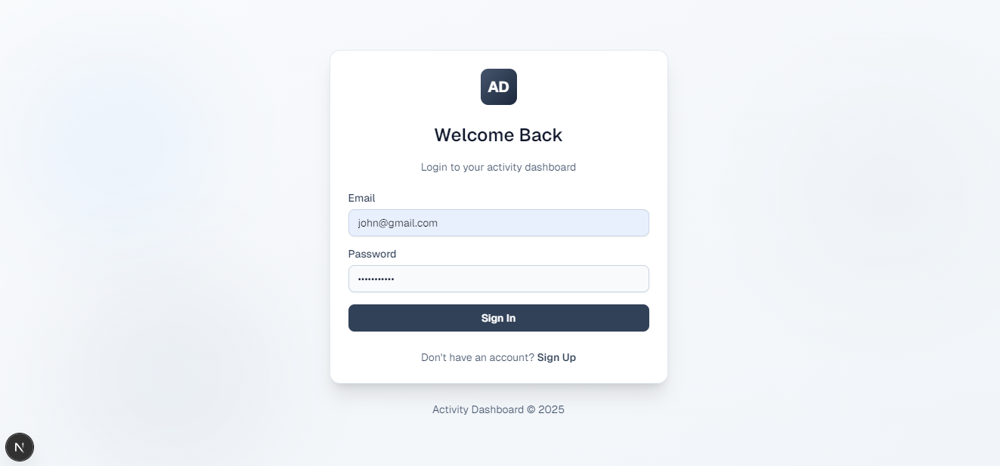
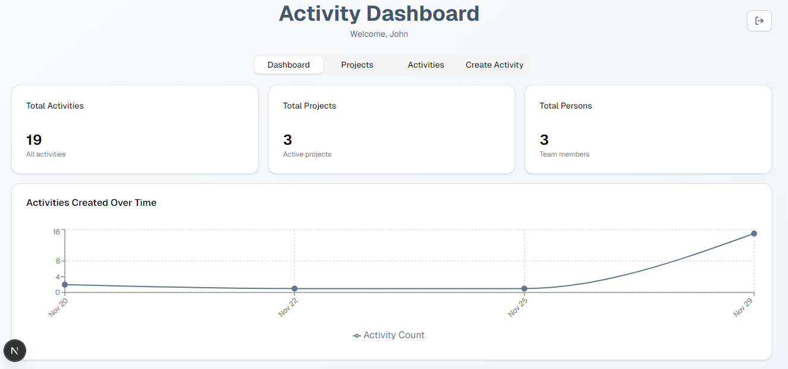
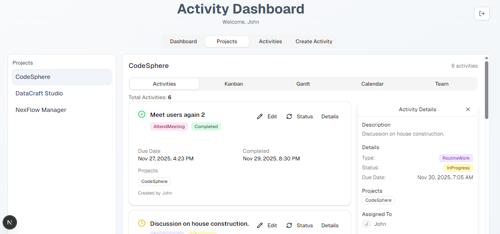
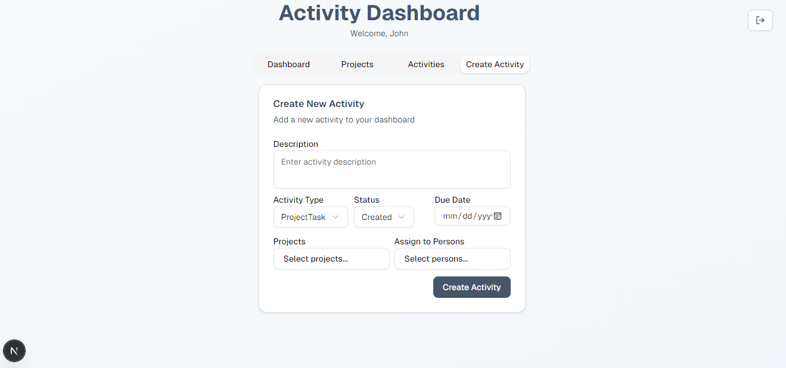

# 🚀 Activity Dashboard

A comprehensive web app for managing and tracking activities, projects, and teams! 🗂️✨

*Login: Secure authentication for your team.*

*Dashboard view: See all activities at a glance.*

*Projects: Tag and organize activities by project.*

*Activities List: Filter, edit, and manage activities.*

*Create Activity: Add new tasks with details and tags.*

## 🛠️ Tech Stack

- ⚛️ **Frontend**: Next.js 16 + React 19
- 🎨 **Styling**: Tailwind CSS 4 + shadcn/ui
- 🗄️ **Database**: SQL Server
- 🔗 **ORM**: Prisma
- 📝 **Forms**: React Hook Form + Zod
- 🔔 **Notifications**: Sonner toast
- 🎯 **Icons**: Lucide React

## 🌟 Features

### 📝 Activity Management
- Create activities with description, type, and status
- Set due dates & track completion
- Choose from types: ProjectTask 🏗️, RoutineWork 🔄, AttendMeeting 📅, Other 🧩

### 🏷️ Tagging & Assignment
- Tag multiple projects per activity 🏷️
- Assign activities to team members 👥
- Quick tag removal with badges 🏷️❌

### 📊 Dashboard
- View all activities in a clean list 🧾
- Real-time status indicators: Created 🟡, InProgress 🟠, Completed 🟢
- Visual activity type icons

### 🔎 Advanced Filtering
- Filter by date range 📅
- Filter by project(s) 🏗️
- Filter by person(s) 👤
- Filter by status 🟡🟠🟢
- Apply multiple filters at once
- Reset filters to view all activities 🔄

### 📋 Activity Details
- View complete info
- Edit activity details ✏️
- Delete activities with confirmation 🗑️
- Track creation details & creator info

## ⚡ Performance Optimization

- Prisma client uses singleton pattern 🦾
- Indexed database queries ⚡
- React 19 optimized UI 🚀
- Images unoptimized by default (can be changed in next.config.js) 🖼️

## 📄 License

MIT License – use freely for personal or commercial projects! 🆓

